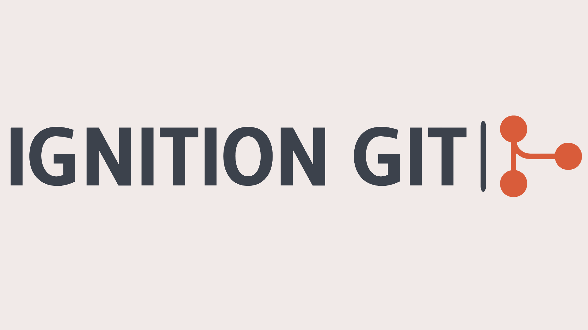

<div id="top"></div>

[![Contributors][contributors-shield]][contributors-url]
[![Forks][forks-shield]][forks-url]
[![Stargazers][stars-shield]][stars-url]
[![Issues][issues-shield]][issues-url]
[![MIT License][license-shield]][license-url]


<!-- PROJECT LOGO -->
<br />
<div align="center">
  <a href="https://github.com/jimender2/Ignition-Git">
    
  </a>

<h3 align="center">Ignition Git</h3>

  <p align="center">
    JGit wrapper for Ignition.
    <br />
    <a href="https://github.com/jimender2/Ignition-Git"><strong>Explore the docs »</strong></a>
    <br />
    <br />
    <a href="https://github.com/jimender2/Ignition-Git/issues">Report Bug</a>
    ·
    <a href="https://github.com/jimender2/Ignition-Git/issues">Request Feature</a>
  </p>
</div>


<!-- TABLE OF CONTENTS -->
<details>
  <summary>Table of Contents</summary>
  <ol>
    <li>
      <a href="#about-the-project">About The Project</a>
      <ul>
        <li><a href="#built-with">Built With</a></li>
      </ul>
    </li>
    <li>
      <a href="#getting-started">Getting Started</a>
      <ul>
        <li><a href="#prerequisites">Prerequisites</a></li>
        <li><a href="#installation">Installation</a></li>
      </ul>
    </li>
    <li><a href="#usage">Usage</a></li>
    <li><a href="#roadmap">Roadmap</a></li>
    <li><a href="#contributing">Contributing</a></li>
    <li><a href="#license">License</a></li>
    <li><a href="#contact">Contact</a></li>
    <li><a href="#acknowledgments">Acknowledgments</a></li>
  </ol>
</details>


<!-- ABOUT THE PROJECT -->
## About The Project

This project integrates basic git functionality through scripting directly into Inductive Automation's Ignition 8 platform. 

Please note that this project is not associated with the Ignition or Inductive Automation team in any way.

<p align="right">(<a href="#top">back to top</a>)</p>


<!-- GETTING STARTED -->
## Getting Started

This is an example of how you may give instructions on setting up your project locally.
To get a local copy up and running follow these simple example steps.


## Installation

Download the latest release from https://github.com/jimender2/Ignition-Git/releases/latest


### Development Prerequisites

This is an example of how to list things you need to use the software and how to install them.
* JDK version 11 or later
* Maven
* IDE to edit the project with


### Develeopment Installation

1. Clone the repo
   ```sh
   git clone https://github.com/jimender2/Ignition-Git.git
   ```
2. Build the module using mvn clean build and then signing the resulting file.
3. Install module on the Ignition Gateway
<p align="right">(<a href="#top">back to top</a>)</p>


<!-- USAGE EXAMPLES -->
## Usage

Simple instructions coming soon.

_For more examples, please refer to the [Documentation (Coming Soon)](Coming Soon)_

<p align="right">(<a href="#top">back to top</a>)</p>


<!-- ROADMAP -->
## Roadmap

- [] Documentation
- [] RPC function
- [] More functions

See the [open issues](https://github.com/jimender2/Ignition-Git/issues) for a full list of proposed features (and known issues).

<p align="right">(<a href="#top">back to top</a>)</p>


<!-- CONTRIBUTING -->
## Contributing

Contributions are what make the open source community such an amazing place to learn, inspire, and create. Any contributions you make are **greatly appreciated**.

If you have a suggestion that would make this better, please fork the repo and create a pull request. You can also simply open an issue with the tag "enhancement".
Don't forget to give the project a star! Thanks again!

1. Fork the Project
2. Create your Feature Branch (`git checkout -b feature/AmazingFeature`)
3. Commit your Changes (`git commit -m 'Add some AmazingFeature'`)
4. Push to the Branch (`git push origin feature/AmazingFeature`)
5. Open a Pull Request

<p align="right">(<a href="#top">back to top</a>)</p>


<!-- LICENSE -->
## License

Distributed under the MIT License. See `LICENSE` for more information.

<p align="right">(<a href="#top">back to top</a>)</p>


<!-- CONTACT -->
## Contact

Jimender2 - jimender2 at jimender2.net

Project Link: [https://github.com/jimender2/Ignition-Git](https://github.com/jimender2/Ignition-Git)

<p align="right">(<a href="#top">back to top</a>)</p>


<!-- ACKNOWLEDGMENTS -->
## Acknowledgments

* [Inductive Automation](https://inductiveautomation.com/)
* [JGit](https://www.eclipse.org/jgit/)

<p align="right">(<a href="#top">back to top</a>)</p>


<!-- MARKDOWN LINKS & IMAGES -->
<!-- https://www.markdownguide.org/basic-syntax/#reference-style-links -->
[contributors-shield]: https://img.shields.io/github/contributors/jimender2/Ignition-Git.svg?style=for-the-badge
[contributors-url]: https://github.com/jimender2/Ignition-Git/graphs/contributors
[forks-shield]: https://img.shields.io/github/forks/jimender2/Ignition-Git.svg?style=for-the-badge
[forks-url]: https://github.com/jimender2/Ignition-Git/network/members
[stars-shield]: https://img.shields.io/github/stars/jimender2/Ignition-Git.svg?style=for-the-badge
[stars-url]: https://github.com/jimender2/Ignition-Git/stargazers
[issues-shield]: https://img.shields.io/github/issues/jimender2/Ignition-Git.svg?style=for-the-badge
[issues-url]: https://github.com/jimender2/Ignition-Git/issues
[license-shield]: https://img.shields.io/github/license/jimender2/Ignition-Git.svg?style=for-the-badge
[license-url]: https://github.com/jimender2/Ignition-Git/blob/master/LICENSE
[product-screenshot]: images/screenshot.png